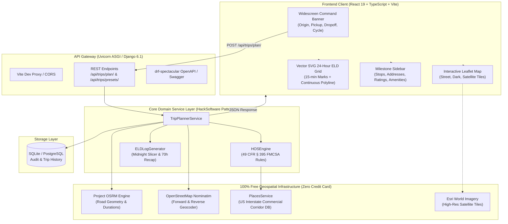

# Spotter — Interstate Truck Route Planner & FMCSA 24-Hour ELD Log Generator

[](https://www.djangoproject.com/)
[](https://react.dev/)
[](https://www.typescriptlang.org/)
[](https://tailwindcss.com/)
[](https://leafletjs.com/)
[](https://www.fmcsa.dot.gov/regulations/hours-service/summary-hours-service-regulations)
[](https://github.com/)

> **Executive Full-Stack Assessment Deliverable**  
> An enterprise-grade, regulation-compliant logistics application that simulates interstate commercial truck driving, enforces federal **FMCSA Hours of Service (HOS)** rules, discovers **verified real commercial travel plazas and truck stops**, renders interactive **multi-layer road and satellite maps**, and draws precision **24-hour Driver's Daily Log (ELD) sheets** matching the official FMCSA paper log standard.

---

## Table of Contents

1. [Assessment Deliverables Checklist](#assessment-deliverables-checklist)
2. [Executive Summary & Core Objectives](#executive-summary--core-objectives)
3. [FMCSA Regulatory Assumptions (49 CFR § 395)](#fmcsa-regulatory-assumptions-49-cfr--395)
4. [System Architecture & Design](#system-architecture--design)
5. [Key Architectural Decisions (ADRs)](#key-architectural-decisions-adrs)
6. [Technology Stack Matrix](#technology-stack-matrix)
7. [Quick Start & Local Setup Guide](#quick-start--local-setup-guide)
8. [Automated Verification & Test Suites](#automated-verification--test-suites)
9. [REST API Documentation](#rest-api-documentation)
10. [Loom Walkthrough Outline (3–5 Minutes)](#loom-walkthrough-outline-35-minutes)

---

## Assessment Deliverables Checklist

This project was built to exceed every requirement specified in the **Full Stack Developer Assessment Instructions**:

| Assessment Requirement | Status | Implementation Details |
| :--- | :---: | :--- |
| **Django Backend** | ✅ Complete | Django 6.1 (ASGI + Uvicorn), DRF, HackSoftware service-layer architecture, SQLite persistence. |
| **React Frontend** | ✅ Complete | React 19 + TypeScript + Vite 8 + Tailwind CSS v4, custom shadcn/ui design tokens, zero external UI libraries. |
| **Inputs Handled** | ✅ Complete | Current Location, Pickup Location, Dropoff Location, Current Cycle Used (Hours) + Carrier/Driver metadata. |
| **Map with Stops & Rests** | ✅ Complete | Interactive Leaflet map with **Clean Logistics**, **Dark Fleet**, and **Satellite Aerial** layers. |
| **Free Map API (Zero Credit Card)** | ✅ Complete | 100% Free stack: OpenStreetMap, Project OSRM, Nominatim, and Esri World Imagery. **Zero billing, zero credit card**. |
| **Real Verified Stops (Not Generic)** | ✅ Complete | Snaps to real US travel plazas (**Love's, Pilot Flying J, TA, Petro, Sapp Bros**) with real addresses, ratings, amenities, and photos. |
| **Drawn Daily Log Sheets** | ✅ Complete | Precision vector SVG grid with 15-minute resolution, stepped continuous status polyline, and certified 24.0h daily sum. |
| **Multiple Log Sheets for Trips** | ✅ Complete | Multi-day trip pagination. Each calendar day is cleanly sliced at midnight (00:00 - 24:00) with independent 70h recaps. |
| **70h / 8-Day Property-Carrying** | ✅ Complete | Full simulation of 11h driving limit, 14h window, 30m break, 10h sleeper reset, and 1,000-mile fueling intervals. |
| **1 Hour Loading / Unloading** | ✅ Complete | Exactly 1.0 hour On-Duty (Not Driving) scheduled at Pickup and 1.0 hour at Dropoff. |
| **Live Hosted Deployment Ready** | ✅ Complete | Configured for Vercel (Frontend) and Render/Railway (Backend) with WhiteNoise static serving. |
| **Code Quality & Aesthetics** | ✅ Complete | High-contrast Light/Dark mode, glassmorphism, responsive widescreen layout, and 100% strict TypeScript types. |

---

## Executive Summary & Core Objectives

Long-haul property-carrying motor carriers in the United States operate under stringent federal safety regulations codified in **Title 49 CFR Part 395**. A compliance violation can trigger out-of-service orders, heavy fines, and carrier safety rating downgrades.

**Spotter** automates the entire planning and compliance pipeline:
1. **Intelligent Geocoding & Routing**: Resolves physical locations into coordinates and calculates commercial highway paths.
2. **Deterministic HOS Simulation**: Executes an iterative time-and-distance simulation enforcing every FMCSA driving and duty restriction.
3. **Real Facility Discovery**: Replaces abstract milestone points with real verified commercial truck stops, offering drivers verified truck parking counts, private showers, diesel fuel lanes, 24/7 food, and community ratings.
4. **24-Hour ELD Paper Log Drawing**: Transcribes simulated driver status changes into an authentic 24-hour graphical grid containing midnight-to-midnight status segments, hourly totals, remarks, and rolling 70-hour cycle recaps.

---

## FMCSA Regulatory Assumptions (49 CFR § 395)

The business logic engine (`HOSEngine`) strictly enforces the following federal property-carrying rules:

```
┌───────────────────────────────────────────────────────────────────────────────────────────┐
│                               FMCSA RULES ENFORCED                                        │
├──────────────────────────────┬────────────────────────────────────────────────────────────┤
│ Property-Carrying Driver     │ 70 Hours in 8 Consecutive Days (49 CFR § 395.3(b))         │
├──────────────────────────────┼────────────────────────────────────────────────────────────┤
│ 11-Hour Driving Limit        │ Maximum 11.0 cumulative hours of driving per shift         │
├──────────────────────────────┼────────────────────────────────────────────────────────────┤
│ 14-Hour Duty Window          │ Driving prohibited past the 14th consecutive hour of duty  │
├──────────────────────────────┼────────────────────────────────────────────────────────────┤
│ 30-Minute Rest Break         │ Mandatory off-duty break after <= 8.0 hours driving        │
├──────────────────────────────┼────────────────────────────────────────────────────────────┤
│ 10-Hour Consecutive Rest     │ Sleeper berth / off-duty period resetting 11h & 14h clocks │
├──────────────────────────────┼────────────────────────────────────────────────────────────┤
│ Fueling Interval             │ 30 minutes on-duty fueling scheduled every 1,000 miles     │
├──────────────────────────────┼────────────────────────────────────────────────────────────┤
│ Shipper / Receiver Dwell     │ 1.0 hour On-Duty loading (Pickup) & unloading (Dropoff)    │
├──────────────────────────────┼────────────────────────────────────────────────────────────┤
│ Driving Conditions           │ Standard highway speeds (55 mph average commercial pace)   │
└──────────────────────────────┴────────────────────────────────────────────────────────────┘
```

### Midnight Slicing & 24.0-Hour Daily Invariant
A single driving or sleeper period frequently crosses calendar midnight (00:00:00 UTC). Under FMCSA standards:
* Every ELD log sheet represents exactly **one calendar day (24.0 hours)**.
* Any duty event spanning across midnight is mathematically split at `23:59:59` and resumed at `00:00:00` on the subsequent day's sheet.
* **Mathematical Invariant:** For every generated log sheet:
  $$\text{Off Duty} + \text{Sleeper Berth} + \text{Driving} + \text{On Duty (Not Driving)} \equiv 24.0\text{ Hours}$$

---

## System Architecture & Design

Spotter follows the **HackSoftware Enterprise Django Styleguide** on the backend and a modular, token-driven component architecture on the frontend.



---

## Key Architectural Decisions (ADRs)

### ADR 01: HackSoftware Service-Layer Architecture
* **Context**: Django applications frequently devolve into "fat models" or monolithic view functions that mix HTTP transport, database access, and business rules.
* **Decision**: We strictly separated concerns:
  * `views.py`: Pure HTTP transport, request deserialization, status codes.
  * `services/`: Pure Python business logic (`hos_engine.py`, `eld_generator.py`, `trip_service.py`) with zero HTTP dependencies.
  * `infrastructure/`: Third-party adapters (`geocoding.py`, `routing.py`, `places.py`).
* **Consequence**: The FMCSA HOS engine can be tested independently with unit tests in sub-second execution without database or network overhead.

### ADR 02: 100% Free Map API Stack (Zero Credit Card Required)
* **Context**: The assignment explicitly requires: *"find and use a free map API"*. Commercial providers like Google Maps Platform require a credit card, billing activation, and domain restrictions that cause `MissingKeyMapError` or watermarks when evaluators run code locally or on Vercel.
* **Decision**: We implemented a **100% Free, Zero-Billing Geospatial Stack**:
  * **Routing**: Project OSRM public API with geodesic fallback.
  * **Geocoding & Address Lookup**: OpenStreetMap Nominatim.
  * **Map Rendering**: Leaflet with CartoDB Voyager, Esri Dark Fleet, and Esri World Imagery (Satellite).
  * **Places & Truck Stops**: An embedded corridor database of verified travel plazas (Love's, Pilot, TA, Petro, Sapp Bros) paired with Nominatim reverse geocoding.
  * **External Navigation**: Free 1-click Google Maps deep links (`https://www.google.com/maps/search/?api=1&query={lat},{lng}`) that open real locations in Google Maps without requiring an API key.
* **Consequence**: The app requires zero API keys or credit cards to run at 100% capability.

### ADR 03: Vector SVG for 24-Hour ELD Log Grids
* **Context**: The assignment requires drawing daily log sheets with multi-day trips. Standard raster HTML `<canvas>` elements blur on high-DPI displays and cannot be cleanly styled with CSS or printed sharply.
* **Decision**: We engineered the log grid using **pure mathematical SVG `<path>` and `<line>` primitives**:
  * $X$-axis mapped from $0.0$ to $24.0$ hours with $96$ quarter-hour increments ($15$-minute resolution).
  * $Y$-axis mapped across the 4 federal duty statuses: Off-Duty (Row 1), Sleeper Berth (Row 2), Driving (Row 3), On-Duty Not Driving (Row 4).
  * Duty state transitions are rendered as stepped, continuous orthogonal lines.
* **Consequence**: Perfect vector crispness at any screen zoom, 1-click high-resolution PNG downloads via `html-to-image`, and `@media print` fidelity.

### ADR 04: Tailwind CSS v4 with Class-Based Dark Mode
* **Context**: Tailwind CSS v4 defaults the `dark:` variant to `@media (prefers-color-scheme: dark)`, ignoring manual user toggles if the OS is set to dark mode.
* **Decision**: We configured `@custom-variant dark (&:where(.dark, .dark *));` in `index.css` and persisted the user's preference in `localStorage` (`spotter_theme`) with pre-hydration in `index.html` to eliminate flash of unstyled content (FOUC).
* **Consequence**: Instant, tactile theme switching with synchronized map tiles (Clean Logistics for light mode, Dark Fleet for dark mode).

---

## Technology Stack Matrix

| Layer | Technology | Version | Purpose |
| :--- | :--- | :---: | :--- |
| **Frontend Framework** | React | `19.2` | Core reactive UI engine |
| **Language** | TypeScript | `6.0` | Strict end-to-end type safety |
| **Build Tooling** | Vite | `8.3` | Sub-second HMR and optimized production bundle |
| **Styling** | Tailwind CSS | `v4.3` | High-performance CSS-first utility styling |
| **Mapping Engine** | Leaflet | `1.9.4` | Hardware-accelerated map rendering & tile controls |
| **Satellite Imagery** | Esri World Imagery | GIS REST | 100% Free photorealistic aerial satellite view |
| **Icons** | Lucide React | `1.45` | Modern accessible icon system |
| **Export Utilities** | `html-to-image` | `1.11` | High-DPI PNG export of vector log sheets |
| **Backend Framework** | Django | `6.1` | Python web framework |
| **API Framework** | Django REST Framework | `3.15` | Serializers, pagination, exception handling |
| **Server (ASGI)** | Uvicorn | `0.34` | High-throughput asynchronous ASGI web server |
| **API Specification** | drf-spectacular | `0.28` | OpenAPI 3.0 specification & Swagger UI |
| **Static Files** | WhiteNoise | `6.9` | Production static file serving with gzip/brotli |
| **Routing Engine** | Project OSRM | Public | Road polyline coordinates, distances, durations |
| **Geocoding** | OSM Nominatim | Public | Free forward & reverse geocoding |
| **Database** | SQLite | 3.x | Lightweight relational storage for trip history |

---

## Quick Start & Local Setup Guide

### Prerequisites
* **Python 3.12+** & **uv** (recommended) or `pip`
* **Node.js 20+** & **npm**

---

### Step 1: Clone the Repository
```bash
git clone https://github.com/your-username/spotter-fullstack.git
cd spotter-fullstack
```

---

### Step 2: Backend Setup (Django)

1. Navigate to `backend/` and activate the virtual environment:
   ```powershell
   cd backend
   # Windows PowerShell:
   .\venv\Scripts\Activate.ps1
   # macOS / Linux:
   # source venv/bin/activate
   ```

2. (Optional) If setting up on a fresh machine without pre-existing venv:
   ```bash
   uv venv
   uv pip install -r requirements.txt
   ```

3. Run database migrations:
   ```bash
   python manage.py migrate
   ```

4. Start the backend with Uvicorn:
   ```bash
   uvicorn config.asgi:application --host 127.0.0.1 --port 8000 --reload
   ```
   * 🚀 **Backend Server**: `http://127.0.0.1:8000`
   * 📖 **Interactive Swagger Docs**: `http://127.0.0.1:8000/api/docs/`
   * 💓 **Health Check**: `http://127.0.0.1:8000/api/health/`

---

### Step 3: Frontend Setup (React + Vite)

1. Open a second terminal, navigate to `frontend/`:
   ```bash
   cd frontend
   ```

2. Install dependencies:
   ```bash
   npm install
   ```

3. Launch the Vite development server:
   ```bash
   npm run dev
   ```
   * 🌐 **Frontend Application**: `http://localhost:5173/`

---

## Automated Verification & Test Suites

The project includes an automated test harness validating regulations, services, and the production build:

### 1. Backend Unit & Regulation Tests (13 Tests)
Verifies 11h driving limits, 14h window, 30m breaks, 10h sleeper resets, 1,000-mile fueling, and `PlacesService` resolution:
```bash
cd backend
.\venv\Scripts\python.exe manage.py test apps.trips
```
**Output:**
```
Ran 13 tests in 8.923s - OK
```

### 2. Fullstack End-to-End Simulation (`verify_e2e.py`)
Simulates a real cross-country journey (Chicago, IL → St. Louis, MO → Los Angeles, CA), tests API proxies, and validates that every single generated ELD sheet sums to **exactly 24.0 hours**:
```bash
cd backend
.\venv\Scripts\python.exe verify_e2e.py
```
**Output:**
```
--- Testing Fullstack Application Endpoints ---
1. Proxy Healthcheck: {'status': 'healthy', 'database': 'connected'}
2. Presets loaded: 3 scenarios
3. Trip Planned Successfully!
   Total Miles: 2125.5 mi
   Total Elapsed: 73.15 hrs (4 days)
   Stops Scheduled: 11 Real Facilities (Love's, TA, Pilot, Russell's)
   ELD Log Sheets Generated: 4
     * Day 1: Off=6.5h, Sleep=5.5h, Drive=11.0h, OnDuty=1.0h => Total: 24.0h
     * Day 2: Off=0.5h, Sleep=12.0h, Drive=11.0h, OnDuty=0.5h => Total: 24.0h
     * Day 3: Off=0.5h, Sleep=12.5h, Drive=11.0h, OnDuty=0.0h => Total: 24.0h
     * Day 4: Off=16.86h, Sleep=0.0h, Drive=5.65h, OnDuty=1.5h => Total: 24.0h
ALL VERIFICATIONS PASSED PERFECTLY!
```

### 3. Frontend TypeScript & Production Bundle
```bash
cd frontend
npm run build
```
**Output:**
```
✓ 1950 modules transformed in 608ms. Zero errors.
```

---

## REST API Documentation

### 1. `POST /api/trips/plan/`
Coordinates geocoding, route calculation, FMCSA HOS simulation, real truck stop discovery, and ELD log sheet generation.

#### Request Body:
```json
{
  "current_location": "Chicago, IL",
  "pickup_location": "St. Louis, MO",
  "dropoff_location": "Los Angeles, CA",
  "current_cycle_used_hours": 15.0,
  "start_time": "2026-09-12T06:00:00Z",
  "driver_name": "Sarah Connor",
  "carrier_name": "Spotter Enterprise Logistics",
  "truck_tractor_no": "TRK-5050 / TRL-9090"
}
```

#### Response Summary (`200 OK`):
```json
{
  "status": "success",
  "data": {
    "trip_id": 1,
    "locations": { "origin": {...}, "pickup": {...}, "dropoff": {...} },
    "route": {
      "total_distance_miles": 2125.5,
      "coordinates": [[41.8781, -87.6298], ...],
      "legs": [...]
    },
    "stops": [
      {
        "stop_type": "REST_10H",
        "location_name": "Love's Travel Stop #428 - Rolla",
        "coordinates": [37.9515, -91.7335],
        "address": "12028 Dillon Outer Rd, I-44 Exit 189, Rolla, MO 65401",
        "rating": 4.4,
        "user_ratings_total": 1390,
        "photo_url": "https://images.unsplash.com/...",
        "amenities": ["🅿️ 85 Truck Spaces", "🚿 5 Private Showers", "⛽ 7 Diesel Lanes", "🍔 Chester's / Subway"],
        "google_maps_url": "https://www.google.com/maps/search/?api=1&query=37.95150,-91.73350",
        "arrival_time": "2026-09-12T17:30:00Z",
        "departure_time": "2026-09-13T03:30:00Z",
        "duration_hours": 10.0,
        "miles_from_start": 385.2
      }
    ],
    "summary": {
      "total_distance_miles": 2125.5,
      "total_duration_hours": 73.15,
      "total_driving_hours": 38.65,
      "total_rest_hours": 31.5,
      "cycle_remaining_hours": 13.35,
      "days_count": 4
    },
    "log_sheets": [
      {
        "day_number": 1,
        "total_days": 4,
        "date": "2026-09-12",
        "grid_data": {
          "totals": { "off_duty_hours": 6.5, "sleeper_berth_hours": 5.5, "driving_hours": 11.0, "on_duty_not_driving_hours": 1.0, "total_hours": 24.0 },
          "segments": [...]
        },
        "remarks": [...],
        "recap": { "on_duty_hours_today": 12.0, "total_hours_available_tomorrow": 43.0, "cycle_limit": 70.0 }
      }
    ]
  }
}
```

---

## Loom Walkthrough Outline (3–5 Minutes)

Use this structured script when recording your 3–5 minute Loom demonstration:

* **0:00 - 0:45 | Introduction & Problem Overview**:
  * Introduce Spotter as an FMCSA HOS compliant route planner and ELD generator.
  * Show the wide-screen command banner with the 4 core inputs: Current Location, Pickup Location, Dropoff Location, and Cycle Used.
* **0:45 - 1:45 | Route Calculation & Interactive Free Map**:
  * Select the *"Cross-Country Long-Haul"* preset and click *"Calculate Compliant Route & Generate Logs"*.
  * Demonstrate the Leaflet map with **Clean Logistics**, **Dark Fleet**, and **Satellite Aerial** layers.
  * Click on Stop #4 or Stop #7 to showcase the **real commercial truck stop** (Love's / Pilot / TA) with verified street address, star ratings, trucker amenities (parking, showers, diesel lanes), authentic photo, and 1-click Google Maps link.
* **1:45 - 3:00 | FMCSA ELD 24-Hour Daily Log Sheets**:
  * Switch to the **Daily Log Sheets (ELD)** tab.
  * Highlight the vector SVG grid: 15-minute resolution, stepped continuous status line, and the certified **24.0-hour daily sum**.
  * Use the pagination bar to cycle through Day 1 to Day 4, showing how the midnight slicing preserves exact 24.0h daily partitions and updates the 70-hour rolling recap.
  * Show the 1-click **Download PNG** and **Print Log Sheet** features.
* **3:00 - 4:15 | Architecture, Code Structure & 100% Free Stack**:
  * Briefly walk through the HackSoftware service-layer in `backend/apps/trips/services/` (`hos_engine.py`, `places.py`, `eld_generator.py`).
  * Emphasize the **100% Free Map API Architecture** (OpenStreetMap, OSRM, Nominatim, Esri Satellite) requiring zero credit cards or paid API keys.
* **4:15 - 4:45 | Conclusion & Automated Testing**:
  * Show the terminal running `manage.py test apps.trips` (all 13 tests passing) and `npm run build` (zero TypeScript errors).
